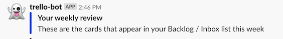

# Weekly Review

I love getting things done and sometimes you need to reflect back on the things you've done. This AWS Lambda function does exactly that. Based on scheduled AWS CloudWatch events, it'll get all items from a specific list in Trello and send them to Slack (because that is where the work happens :smile:)



## Prerequisites

### Environment Variables

The app relies on [AWS Systems Manager Parameter Store](https://aws.amazon.com/systems-manager/features/) (SSM) to store variables on how to connect to Jenkins. Some of the variables are encrypted using KMS. The variables the app relies on are:

* `/prod/trello/key`: The application key to authenticate to Trello (encrypted)
* `/prod/trello/token` The application token to authenticate to Trello (encrypted)
* `/prod/trello/user` The username to get details from Trello (encrypted)
* `/prod/trello/board` The name of the board to get details from
* `/prod/trello/list` The name of the list to get details from
* `/prod/slack/url` The webhook URL to connect to Slack (encrypted)
* `/prod/slack/channel` The name of the Slack channel to post to
* `/prod/slack/user` The name of the user a Slack message should be sent as
* `/prod/slack/emoji` The emoji for the Slack user

These parameters are encrypted using [Amazon KMS](https://aws.amazon.com/kms/) and retrieved from the Parameter Store on deployment. This way the encrypted variables are given to the Lambda function and the function needs to take care of decrypting them at runtime.

To create the encrypted variables, run the below command for all of the variables

```bash
aws ssm put-parameter                       \
   --type String                            \
   --name "<token-name>"                    \
   --value $(aws kms encrypt                \
              --output text                 \
              --query CiphertextBlob        \
              --key-id <YOUR_KMS_KEY_ID>    \
              --plaintext "PLAIN TEXT HERE")
```

To create non-encrypted variables in SSM, run

```bash
aws ssm put-parameter                       \
   --type String                            \
   --name "<token-name>"                    \
   --value  "PLAIN TEXT HERE"
```

To test the function locally, using `SAM`, you'll have to uncomment lines 66-69 in the `template.yaml` file and update these with base64 encoded values from the Parameter Store. Only during deployment to AWS Lambda will these variables get their actual values from the Parameter Store.

## Build and Deploy

There are several `Make` targets available to help build and deploy the function

| Target | Description                                       |
|--------|---------------------------------------------------|
| build  | Build the executable for Lambda                   |
| clean  | Remove all generated files                        |
| deploy | Deploy the app to AWS Lambda                      |
| deps   | Get the Go modules from the GOPROXY               |
| help   | Displays the help for each target (this message). |
| local  | Run SAM to test the Lambda function using Docker  |
| test   | Run all unit tests and print coverage             |

## License

See the [LICENSE](./LICENSE) file for details
